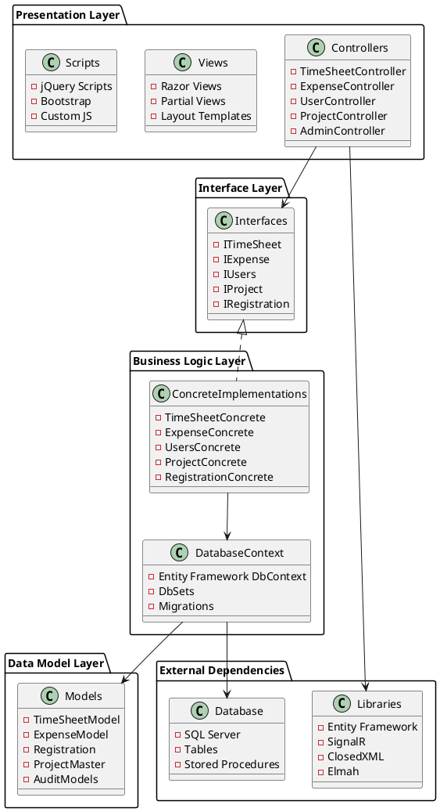
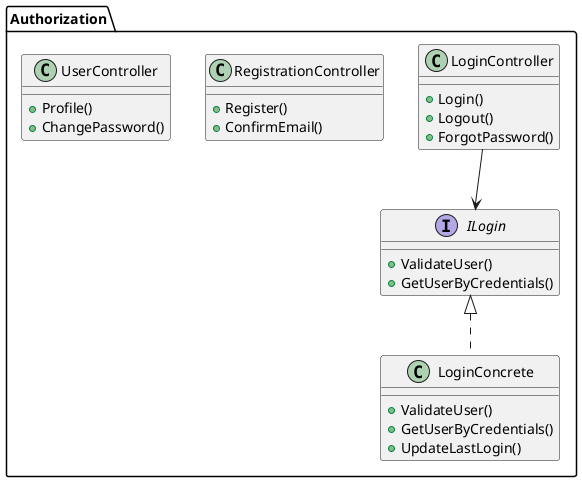
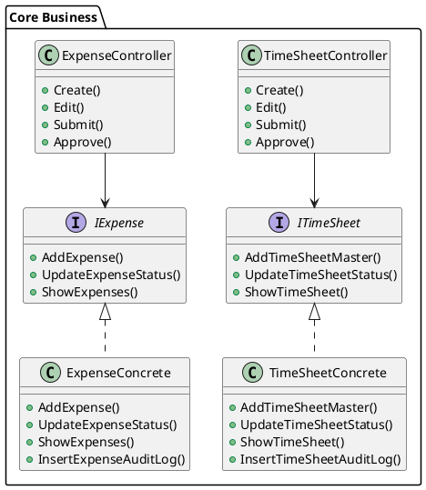

# Architecture Overview - Przegląd Architektury

## C4 Model - System Context

WebTimeSheetManagement w kontekście organizacyjnym:

```plantuml
@startuml
!include https://raw.githubusercontent.com/plantuml-stdlib/C4-PlantUML/master/C4_Context.puml

title System Context - WebTimeSheetManagement

Person(employee, "Employee", "Pracownik firmy")
Person(manager, "Manager", "Menedżer/Przełożony")
Person(admin, "Administrator", "Administrator systemu")
Person(superadmin, "Super Administrator", "Super Administrator")

System(timesheet_system, "WebTimeSheetManagement", "System zarządzania kartami czasu pracy i wydatkami")

System_Ext(email_system, "Email System", "System poczty elektronicznej")
System_Ext(file_storage, "File Storage", "Przechowywanie dokumentów")
SystemDb(database, "SQL Server Database", "Baza danych aplikacji")

Rel(employee, timesheet_system, "Wypełnia karty czasu pracy, dodaje wydatki")
Rel(manager, timesheet_system, "Zatwierdza karty czasu i wydatki")
Rel(admin, timesheet_system, "Zarządza użytkownikami i projektami")
Rel(superadmin, timesheet_system, "Pełne zarządzanie systemem")

Rel(timesheet_system, email_system, "Wysyła powiadomienia")
Rel(timesheet_system, file_storage, "Przechowuje załączniki")
Rel(timesheet_system, database, "Przechowuje dane")

@enduml
```

## Architektura Warstwowa

System wykorzystuje klasyczną architekturę warstwową opartą na wzorcu Repository:



## Wzorce Architektoniczne

### 1. Repository Pattern
- **Interface Layer**: Definicje kontraktów serwisowych
- **Concrete Layer**: Implementacje logiki biznesowej i dostępu do danych
- **Korzyści**: Separacja logiki biznesowej od warstwy danych, łatwość testowania

### 2. Model-View-Controller (MVC)
- **Model**: Encje i modele widoków
- **View**: Widoki Razor z HTML/CSS/JavaScript
- **Controller**: Obsługa żądań HTTP i orchestracja logiki

### 3. Dependency Injection
- Wstrzykiwanie zależności poprzez konstruktory
- Luźne powiązania między warstwami

### 4. Unit of Work
- Zarządzanie transakcjami poprzez Entity Framework DbContext
- Spójność danych w operacjach wielotabelowych

## Kluczowe Komponenty

### Zarządzanie Autoryzacją


### Core Business Logic


## Przepływ Danych

1. **Żądanie HTTP** → Controller
2. **Controller** → Interface (Dependency Injection)
3. **Interface** → Concrete Implementation
4. **Concrete** → DatabaseContext (Entity Framework)
5. **DatabaseContext** → SQL Server Database
6. **Powrót danych** poprzez te same warstwy
7. **Rendering** → Razor View → HTML Response

## Bezpieczeństwo

- **Authentication**: ASP.NET Identity
- **Authorization**: Role-based access control
- **Data Validation**: Model validation attributes
- **Audit Trail**: Automatyczne logowanie zmian
- **Error Handling**: Elmah logging

## Wydajność

- **Caching**: OutputCache dla statycznych danych
- **Lazy Loading**: Entity Framework lazy loading
- **Pagination**: Server-side pagination dla dużych zbiorów danych
- **Compression**: Response compression 