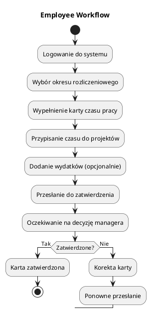
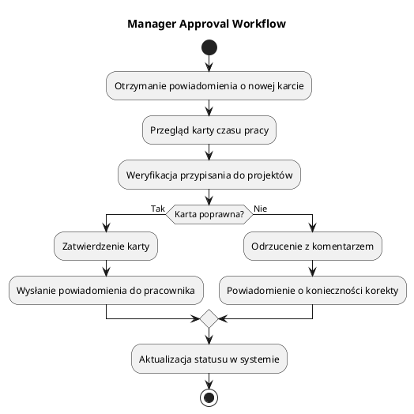
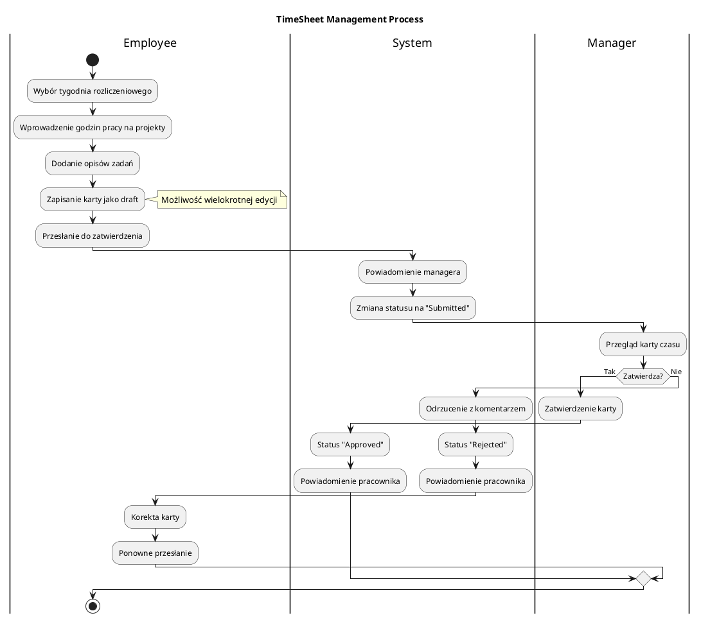
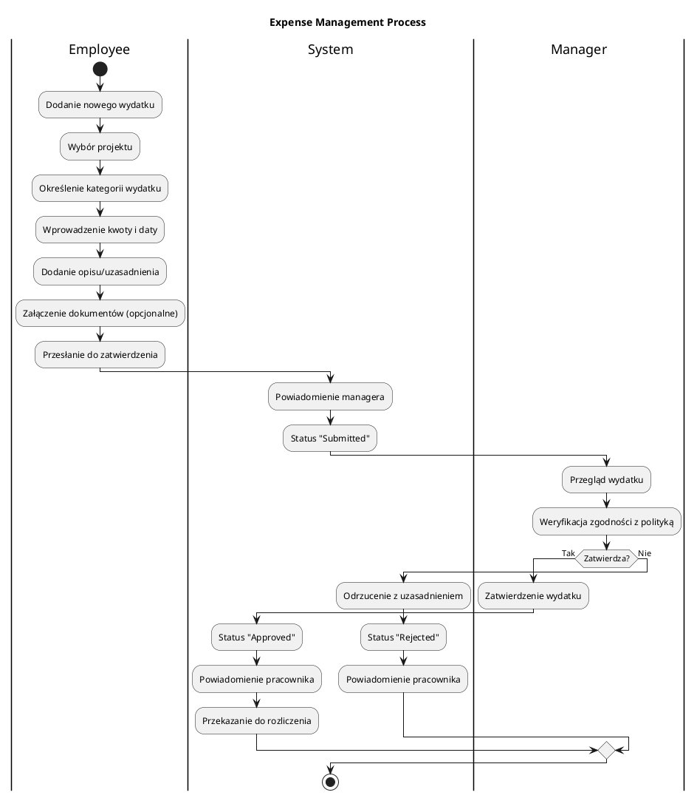

# Business Context - Kontekst Biznesowy

## Cel Biznesowy

WebTimeSheetManagement to system wspierający organizacje w efektywnym zarządzaniu czasem pracy pracowników oraz kontroli wydatków służbowych. System automatyzuje procesy raportowania czasu pracy, ułatwia rozliczenia projektowe oraz zapewnia transparentność w zarządzaniu zasobami ludzkimi.

## Użytkownicy Systemu

### 👤 Employee (Pracownik)
**Rola**: Końcowy użytkownik systemu
**Uprawnienia**:
- Tworzenie i edycja własnych kart czasu pracy
- Dodawanie wydatków służbowych
- Przeglądanie historii własnych timesheetów
- Otrzymywanie powiadomień o statusie zatwierdzenia

**Przepływ pracy**:

### 👨‍💼 Manager (Menedżer)
**Rola**: Przełożony zatwierdzający karty czasu i wydatki
**Uprawnienia**:
- Przeglądanie kart czasu podwładnych
- Zatwierdzanie/odrzucanie timesheetów
- Zatwierdzanie/odrzucanie wydatków
- Dodawanie komentarzy do decyzji
- Generowanie raportów zespołowych

**Przepływ pracy**:

### 🔧 Administrator
**Rola**: Zarządzanie systemem i użytkownikami
**Uprawnienia**:
- Zarządzanie kontami użytkowników
- Tworzenie i edycja projektów
- Konfiguracja ról i uprawnień
- Generowanie raportów systemowych
- Zarządzanie powiadomieniami

### 👑 Super Administrator
**Rola**: Pełne zarządzanie systemem
**Uprawnienia**:
- Wszystkie uprawnienia Administratora
- Zarządzanie konfiguracją systemu
- Dostęp do logów systemowych
- Zarządzanie backupami
- Konfiguracja integracji z systemami zewnętrznymi

## Główne Procesy Biznesowe

### 1. Proces Zarządzania Kartami Czasu Pracy

### 2. Proces Zarządzania Wydatkami

## Korzyści Biznesowe

### 📈 Zwiększenie Efektywności
- **Automatyzacja raportowania**: Eliminacja papierowych timesheetów
- **Szybszy proces zatwierdzania**: Workflow elektroniczny
- **Redukcja błędów**: Walidacja danych na poziomie systemu
- **Oszczędność czasu**: Automatyczne kalkulacje i raporty

### 💰 Kontrola Kosztów
- **Transparentność wydatków**: Pełna widoczność kosztów projektowych
- **Kontrola budżetu**: Monitoring wydatków w czasie rzeczywistym
- **Audyt finansowy**: Kompletny audit trail wszystkich transakcji
- **Optymalizacja zasobów**: Analiza wykorzystania czasu pracy

### 📊 Wsparcie Decyzyjne
- **Raporty projektowe**: Analiza rentowności projektów
- **Monitoring wydajności**: KPI dla zespołów i projektów
- **Planowanie zasobów**: Przewidywanie potrzeb kadrowych
- **Compliance**: Zgodność z regulacjami prawnymi

## Metryki Biznesowe

### KPI (Key Performance Indicators)
- **Czas zatwierdzania kart**: Średni czas od przesłania do zatwierdzenia
- **Wskaźnik odrzuceń**: Procent odrzuconych kart czasu/wydatków
- **Wykorzystanie projektów**: Liczba godzin na projekt
- **Efektywność zespołu**: Liczba zatwierdzonych kart na osobę
- **Kontrola budżetu**: Rzeczywiste vs planowane wydatki

### Cele Biznesowe
1. **Skrócenie czasu rozliczenia** o 50% w porównaniu do procesu papierowego
2. **Zwiększenie dokładności raportowania** do 99%
3. **Redukcja kosztów administracyjnych** o 30%
4. **Poprawa satysfakcji użytkowników** poprzez uproszczenie procesów
5. **Zapewnienie compliance** z wymaganiami audytowymi

## Integracje Systemowe

### Istniejące Systemy
- **HR System**: Synchronizacja danych pracowników
- **Accounting System**: Eksport danych finansowych
- **Project Management**: Synchronizacja projektów
- **Email System**: Powiadomienia i alerty

### Planowane Integracje
- **Mobile App**: Aplikacja mobilna dla pracowników
- **BI Dashboard**: Zaawansowane raportowanie
- **Calendar Integration**: Synchronizacja z kalendarzami
- **Document Management**: Zarządzanie załącznikami 