# Class Diagrams - Diagramy Klas

## Przegląd

Ten dokument zawiera szczegółowe diagramy klas UML dla głównych komponentów aplikacji WebTimeSheetManagement, przedstawiające strukturę klas, ich właściwości, metody oraz relacje między nimi.

## 1. TimeSheet Domain Classes

Główne klasy związane z zarządzaniem kartami czasu pracy:

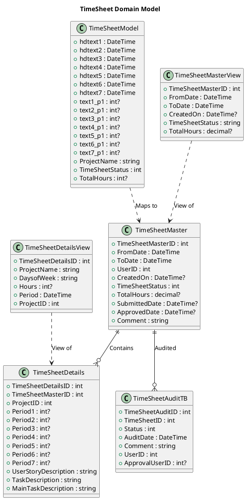

## 2. Expense Domain Classes

Klasy związane z zarządzaniem wydatkami:

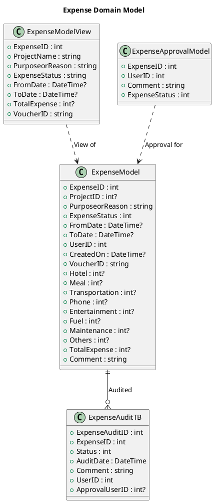

## 3. User Management Classes

Klasy związane z zarządzaniem użytkownikami:

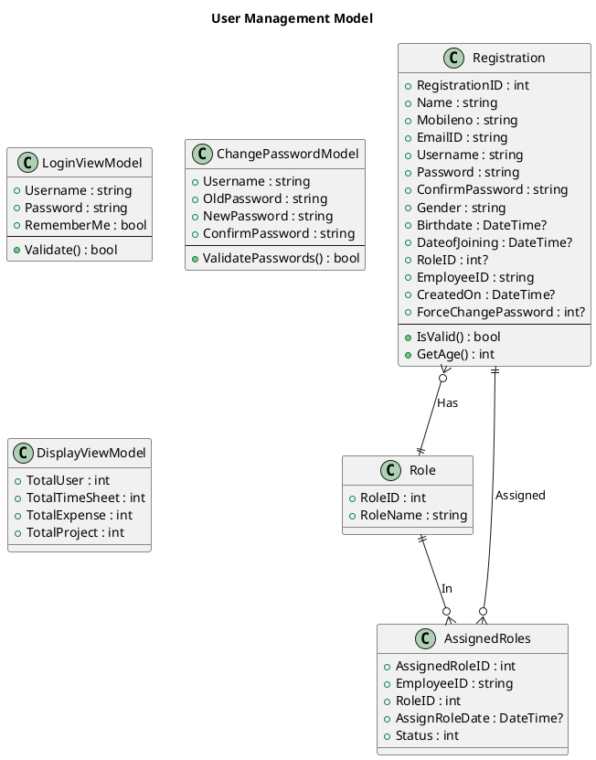

## 4. Project Management Classes

Klasy związane z projektami:

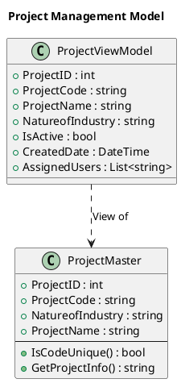

## 5. Notification Classes

Klasy systemu powiadomień:

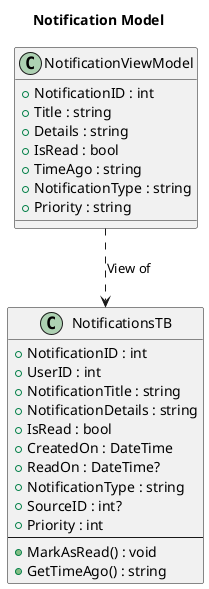

## 6. Document Management Classes

Klasy zarządzania dokumentami:

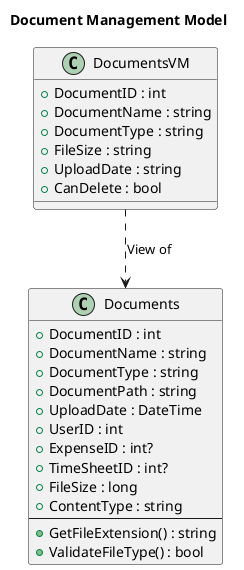

## 7. Audit Classes

Klasy systemu audytu:

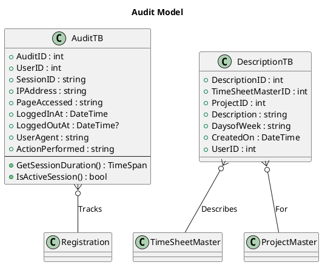

## 8. Business Logic Interfaces

Interfejsy warstwy biznesowej:

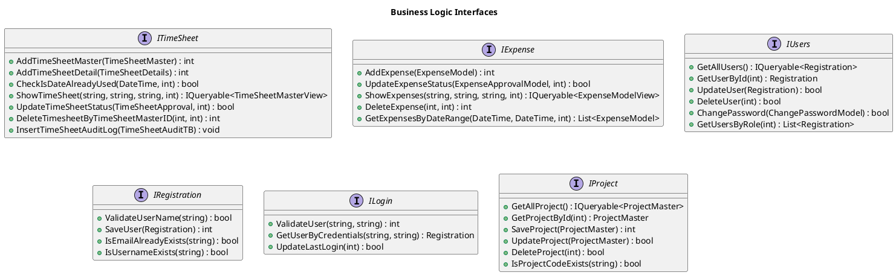

## 9. Repository Implementation Classes

Implementacje interfejsów:

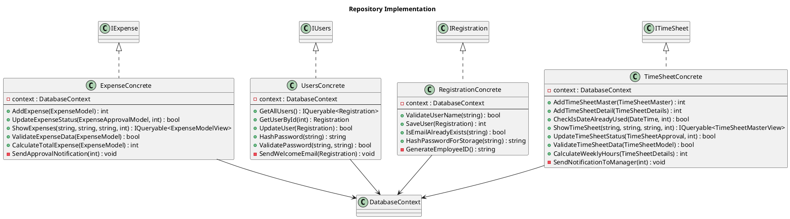

## 10. Database Context

Kontekst Entity Framework:

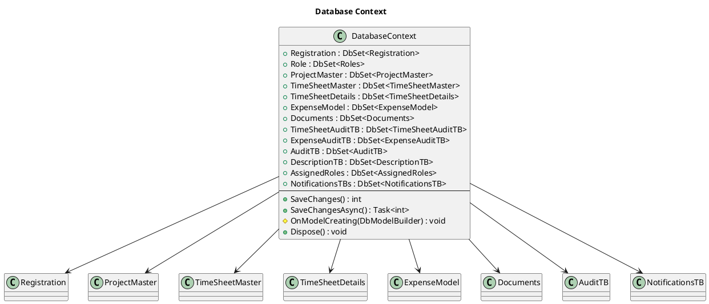

## 11. Controller Classes

Główne kontrolery MVC:

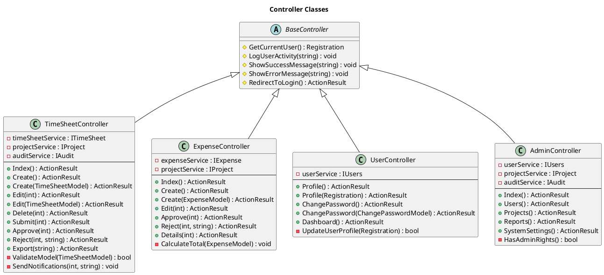

## Relacje między Klasami

Główne relacje w systemie:

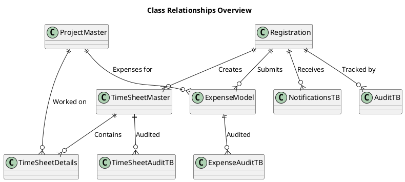