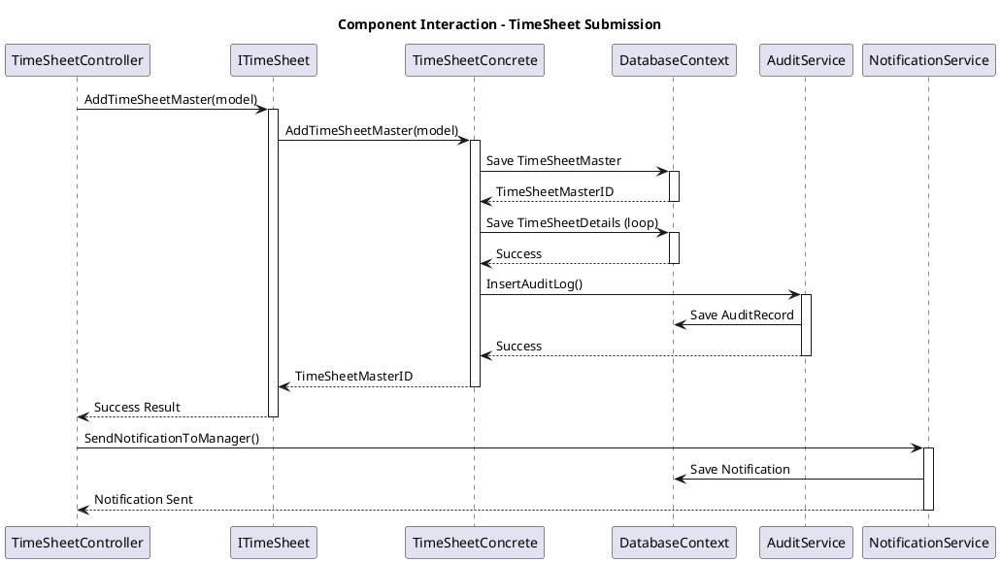
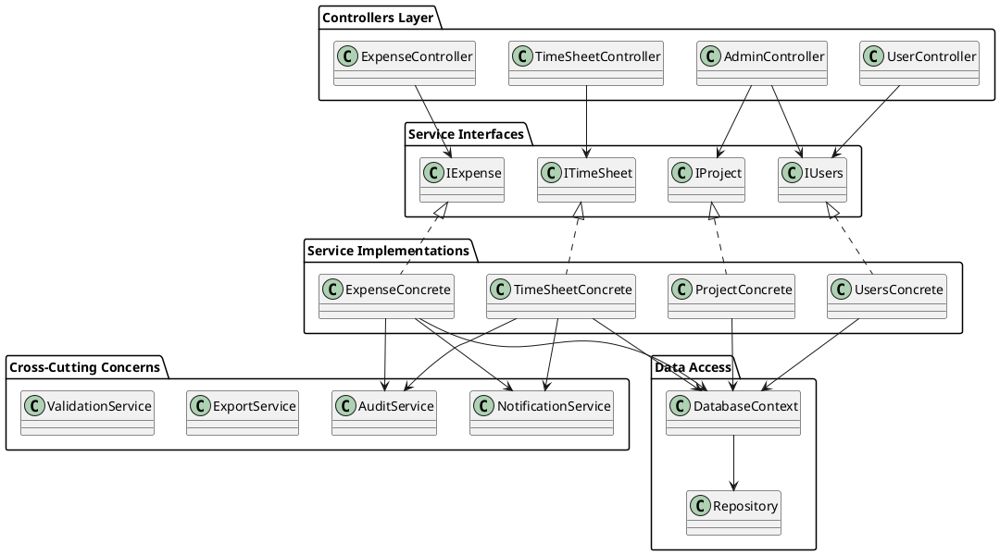

# Components - Diagram Komponentów C4

## Component Architecture - Detailed View

Diagram komponentów przedstawia szczegółową strukturę głównych modułów aplikacji WebTimeSheetManagement:

```plantuml
@startuml
!include https://raw.githubusercontent.com/plantuml-stdlib/C4-PlantUML/master/C4_Component.puml

title Component Diagram - WebTimeSheetManagement

Container_Boundary(web_app, "Web Application") {
    Component(timesheet_controller, "TimeSheet Controller", "MVC Controller", "Obsługuje operacje związane z kartami czasu pracy")
    Component(expense_controller, "Expense Controller", "MVC Controller", "Zarządza wydatkami służbowymi")
    Component(user_controller, "User Controller", "MVC Controller", "Zarządzanie profilami użytkowników")
    Component(admin_controller, "Admin Controller", "MVC Controller", "Funkcje administracyjne")
    Component(auth_controller, "Authentication Controller", "MVC Controller", "Logowanie i rejestracja")
    Component(signalr_hub, "Notification Hub", "SignalR Hub", "Real-time powiadomienia")
}

Container_Boundary(business_logic, "Business Logic Layer") {
    Component(timesheet_service, "TimeSheet Service", "C# Class", "Logika biznesowa kart czasu")
    Component(expense_service, "Expense Service", "C# Class", "Logika biznesowa wydatków")
    Component(user_service, "User Service", "C# Class", "Zarządzanie użytkownikami")
    Component(project_service, "Project Service", "C# Class", "Zarządzanie projektami")
    Component(audit_service, "Audit Service", "C# Class", "Logowanie operacji")
    Component(notification_service, "Notification Service", "C# Class", "Obsługa powiadomień")
    Component(export_service, "Export Service", "C# Class", "Eksport danych do Excel/PDF")
}

Container_Boundary(data_access, "Data Access Layer") {
    Component(db_context, "Database Context", "Entity Framework", "Kontekst bazy danych")
    Component(repository, "Repository Pattern", "C# Interfaces", "Abstrakcja dostępu do danych")
}

ContainerDb(database, "SQL Server Database", "Relational Database", "Przechowuje wszystkie dane aplikacji")

Rel(timesheet_controller, timesheet_service, "Uses")
Rel(expense_controller, expense_service, "Uses")
Rel(user_controller, user_service, "Uses")
Rel(admin_controller, user_service, "Uses")
Rel(admin_controller, project_service, "Uses")
Rel(auth_controller, user_service, "Uses")

Rel(timesheet_service, repository, "Uses")
Rel(expense_service, repository, "Uses")
Rel(user_service, repository, "Uses")
Rel(project_service, repository, "Uses")
Rel(audit_service, repository, "Uses")
Rel(notification_service, signalr_hub, "Uses")
Rel(export_service, repository, "Uses")

Rel(repository, db_context, "Uses")
Rel(db_context, database, "Connects to")

@enduml
```

## TimeSheet Management Components

Szczegółowy widok komponentów zarządzania kartami czasu pracy:

```plantuml
@startuml
package "TimeSheet Management" {
    component "TimeSheetController" {
        + Create()
        + Edit()
        + Submit()
        + View()
        + Delete()
        + Export()
    }
    
    component "ITimeSheet Interface" {
        + AddTimeSheetMaster()
        + AddTimeSheetDetail()
        + UpdateTimeSheetStatus()
        + ShowTimeSheet()
        + DeleteTimesheet()
        + CheckIsDateAlreadyUsed()
    }
    
    component "TimeSheetConcrete" {
        + AddTimeSheetMaster()
        + AddTimeSheetDetail()
        + UpdateTimeSheetStatus()
        + ShowTimeSheet()
        + DeleteTimesheet()
        + InsertTimeSheetAuditLog()
        + ValidateTimeSheetData()
        + CalculateWeeklyHours()
    }
    
    component "TimeSheet Models" {
        + TimeSheetModel
        + TimeSheetMaster
        + TimeSheetDetails
        + TimeSheetMasterView
        + TimeSheetDetailsView
        + TimeSheetAuditTB
    }
    
    component "TimeSheet Views" {
        + Create.cshtml
        + Edit.cshtml
        + Index.cshtml
        + Details.cshtml
        + _TimeSheetForm.cshtml
    }
}

TimeSheetController --> "ITimeSheet Interface"
"ITimeSheet Interface" <|.. TimeSheetConcrete
TimeSheetConcrete --> "TimeSheet Models"
TimeSheetController --> "TimeSheet Views"
"TimeSheet Views" --> "TimeSheet Models"
@enduml
```

## Expense Management Components

Komponenty zarządzania wydatkami służbowymi:

```plantuml
@startuml
package "Expense Management" {
    component "ExpenseController" {
        + Create()
        + Edit()
        + Submit()
        + Approve()
        + Reject()
        + View()
        + Export()
    }
    
    component "IExpense Interface" {
        + AddExpense()
        + UpdateExpenseStatus()
        + ShowExpenses()
        + DeleteExpense()
        + GetExpensesByUser()
        + GetExpensesByProject()
    }
    
    component "ExpenseConcrete" {
        + AddExpense()
        + UpdateExpenseStatus()
        + ShowExpenses()
        + DeleteExpense()
        + ValidateExpenseData()
        + CalculateExpenseTotal()
        + InsertExpenseAuditLog()
    }
    
    component "Expense Models" {
        + ExpenseModel
        + ExpenseModelView
        + ExpenseApprovalModel
        + ExpenseAuditTB
    }
    
    component "Expense Views" {
        + Create.cshtml
        + Edit.cshtml
        + Index.cshtml
        + Approve.cshtml
        + Details.cshtml
    }
}

ExpenseController --> "IExpense Interface"
"IExpense Interface" <|.. ExpenseConcrete
ExpenseConcrete --> "Expense Models"
ExpenseController --> "Expense Views"
"Expense Views" --> "Expense Models"
@enduml
```

## User Management Components

Komponenty zarządzania użytkownikami i autoryzacji:

```plantuml
@startuml
package "User Management" {
    component "Authentication Controllers" {
        component LoginController {
            + Login()
            + Logout()
            + ForgotPassword()
        }
        
        component RegistrationController {
            + Register()
            + ConfirmEmail()
        }
        
        component UserController {
            + Profile()
            + ChangePassword()
            + UpdateProfile()
        }
    }
    
    component "User Interfaces" {
        interface ILogin {
            + ValidateUser()
            + GetUserByCredentials()
        }
        
        interface IRegistration {
            + RegisterUser()
            + ValidateRegistration()
        }
        
        interface IUsers {
            + GetUserById()
            + UpdateUser()
            + GetAllUsers()
        }
    }
    
    component "User Concrete Classes" {
        class LoginConcrete {
            + ValidateUser()
            + GetUserByCredentials()
            + UpdateLastLogin()
            + HashPassword()
        }
        
        class RegistrationConcrete {
            + RegisterUser()
            + ValidateRegistration()
            + SendConfirmationEmail()
        }
        
        class UsersConcrete {
            + GetUserById()
            + UpdateUser()
            + GetAllUsers()
            + ChangePassword()
        }
    }
    
    component "User Models" {
        + Registration
        + LoginViewModel
        + ChangePasswordModel
        + DisplayViewModel
        + Role
        + AssignedRoles
    }
}

LoginController --> ILogin
RegistrationController --> IRegistration
UserController --> IUsers

ILogin <|.. LoginConcrete
IRegistration <|.. RegistrationConcrete
IUsers <|.. UsersConcrete

LoginConcrete --> "User Models"
RegistrationConcrete --> "User Models"
UsersConcrete --> "User Models"
@enduml
```

## Project Management Components

Komponenty zarządzania projektami:

```plantuml
@startuml
package "Project Management" {
    component "ProjectController" {
        + Index()
        + Create()
        + Edit()
        + Details()
        + Delete()
        + AssignUsers()
    }
    
    component "IProject Interface" {
        + GetAllProject()
        + GetProjectById()
        + SaveProject()
        + UpdateProject()
        + DeleteProject()
    }
    
    component "ProjectConcrete" {
        + GetAllProject()
        + GetProjectById()
        + SaveProject()
        + UpdateProject()
        + DeleteProject()
        + ValidateProjectData()
        + CheckProjectCodeUnique()
    }
    
    component "Project Models" {
        + ProjectMaster
        + ProjectViewModel
    }
}

ProjectController --> "IProject Interface"
"IProject Interface" <|.. ProjectConcrete
ProjectConcrete --> "Project Models"
@enduml
```

## Notification System Components

System powiadomień w czasie rzeczywistym:

```plantuml
@startuml
package "Notification System" {
    component "NotificationController" {
        + Index()
        + Create()
        + MarkAsRead()
        + GetUnreadCount()
    }
    
    component "SignalR Hub" {
        + NotificationHub
        + SendToUser()
        + SendToGroup()
        + BroadcastMessage()
    }
    
    component "INotification Interface" {
        + AddNotification()
        + GetNotificationsByUser()
        + MarkAsRead()
        + DeleteNotification()
    }
    
    component "NotificationConcrete" {
        + AddNotification()
        + GetNotificationsByUser()
        + MarkAsRead()
        + DeleteNotification()
        + SendEmailNotification()
        + SendRealTimeNotification()
    }
    
    component "Notification Models" {
        + NotificationsTB
        + NotificationViewModel
    }
}

NotificationController --> "INotification Interface"
NotificationController --> "SignalR Hub"
"INotification Interface" <|.. NotificationConcrete
NotificationConcrete --> "Notification Models"
NotificationConcrete --> "SignalR Hub"
@enduml
```

## Export System Components

System eksportu danych:

```plantuml
@startuml
package "Export System" {
    component "Export Controllers" {
        component TimeSheetExportController {
            + ExportToExcel()
            + ExportToPDF()
            + ExportByDateRange()
        }
        
        component ExpenseExportController {
            + ExportExpensesToExcel()
            + ExportExpenseReport()
        }
    }
    
    component "Export Interfaces" {
        interface ITimeSheetExport {
            + GetTimesheetDataForExport()
            + GenerateExcelReport()
        }
        
        interface IExpenseExport {
            + GetExpenseDataForExport()
            + GenerateExpenseReport()
        }
    }
    
    component "Export Concrete Classes" {
        class TimeSheetExportConcrete {
            + GetTimesheetDataForExport()
            + GenerateExcelReport()
            + FormatTimeSheetData()
        }
        
        class ExpenseExportConcrete {
            + GetExpenseDataForExport()
            + GenerateExpenseReport()
            + FormatExpenseData()
        }
    }
    
    component "Export Models" {
        + TimeSheetExportModel
        + ExpenseExportModel
        + ExportFilterModel
    }
    
    component "Export Libraries" {
        + ClosedXML (Excel)
        + iTextSharp (PDF)
    }
}

TimeSheetExportController --> ITimeSheetExport
ExpenseExportController --> IExpenseExport

ITimeSheetExport <|.. TimeSheetExportConcrete
IExpenseExport <|.. ExpenseExportConcrete

TimeSheetExportConcrete --> "Export Models"
ExpenseExportConcrete --> "Export Models"
TimeSheetExportConcrete --> "Export Libraries"
ExpenseExportConcrete --> "Export Libraries"
@enduml
```

## Audit System Components

System audytu i logowania:

```plantuml
@startuml
package "Audit System" {
    component "AuditFilter" {
        + OnActionExecuting()
        + OnActionExecuted()
        + LogUserAction()
    }
    
    component "IAudit Interface" {
        + InsertAuditData()
        + GetAuditTrail()
        + GetUserActivity()
    }
    
    component "AuditConcrete" {
        + InsertAuditData()
        + GetAuditTrail()
        + GetUserActivity()
        + LogPageAccess()
        + LogUserLogin()
        + LogDataChanges()
    }
    
    component "Audit Models" {
        + AuditTB
        + TimeSheetAuditTB
        + ExpenseAuditTB
    }
    
    component "Logging Framework" {
        + Elmah
        + Custom Logger
        + Error Handling
    }
}

AuditFilter --> "IAudit Interface"
"IAudit Interface" <|.. AuditConcrete
AuditConcrete --> "Audit Models"
AuditConcrete --> "Logging Framework"
@enduml
```

## Component Interactions

Przepływ interakcji między komponentami podczas typowych operacji:



## Component Dependencies

Zależności między komponentami:

