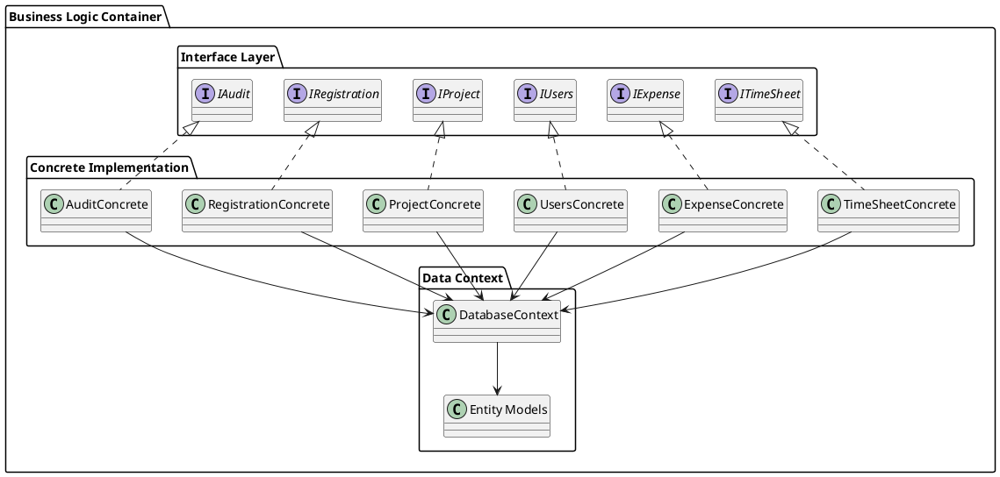
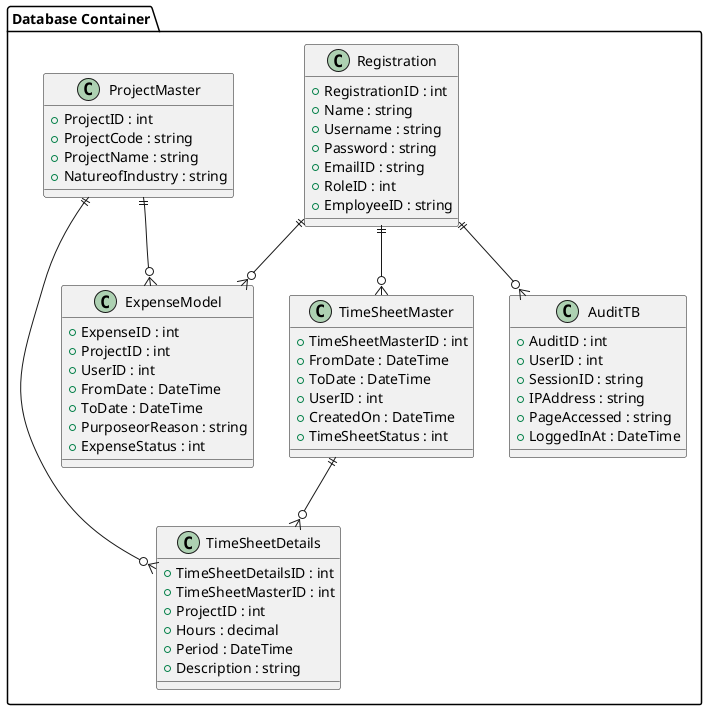
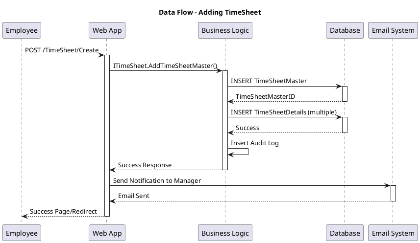
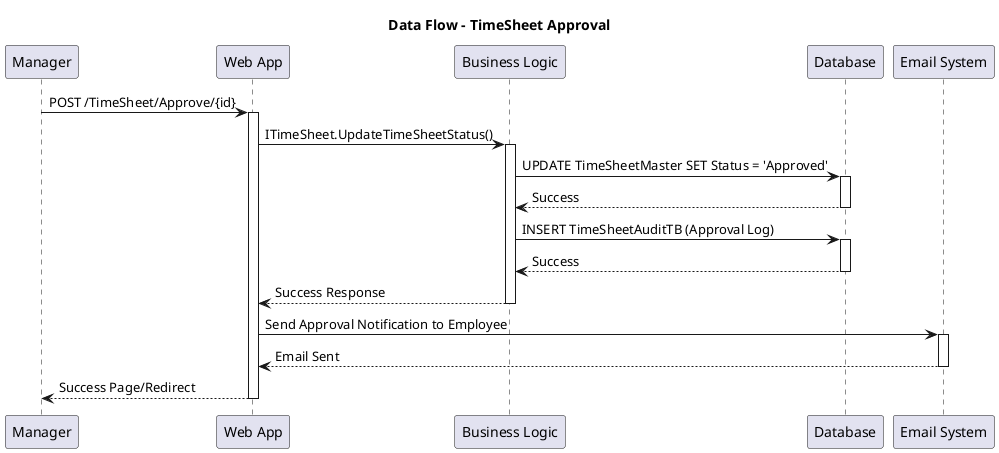

# Containers - Diagram Kontenerów C4

## System Architecture - Container Level

Diagram kontenerów pokazuje główne komponenty aplikacji WebTimeSheetManagement oraz ich interakcje:

```plantuml
@startuml
!include https://raw.githubusercontent.com/plantuml-stdlib/C4-PlantUML/master/C4_Container.puml

title Container Diagram - WebTimeSheetManagement System

Person(employee, "Employee", "Pracownik wypełniający karty czasu")
Person(manager, "Manager", "Menedżer zatwierdzający karty")
Person(admin, "Administrator", "Administrator systemu")

System_Boundary(timesheet_boundary, "WebTimeSheetManagement System") {
    Container(web_app, "Web Application", "ASP.NET MVC 5", "Główna aplikacja webowa z interfejsem użytkownika")
    Container(api_layer, "Business Logic Layer", "C# Classes", "Warstwa logiki biznesowej i dostępu do danych")
    Container(database, "Database", "SQL Server", "Przechowuje dane użytkowników, projektów, timesheetów i wydatków")
    Container(file_storage, "File Storage", "File System", "Przechowuje załączniki i dokumenty")
}

System_Ext(email_system, "Email System", "SMTP Server", "Wysyła powiadomienia email")
System_Ext(ldap, "Active Directory", "LDAP", "Autoryzacja użytkowników (opcjonalna)")

Rel(employee, web_app, "Używa", "HTTPS")
Rel(manager, web_app, "Używa", "HTTPS") 
Rel(admin, web_app, "Używa", "HTTPS")

Rel(web_app, api_layer, "Wywołuje", "In-Process")
Rel(api_layer, database, "Odczytuje/zapisuje", "Entity Framework")
Rel(api_layer, file_storage, "Przechowuje pliki", "File I/O")
Rel(api_layer, email_system, "Wysyła powiadomienia", "SMTP")
Rel_Back(ldap, api_layer, "Autoryzacja", "LDAP Query")

@enduml
```

## Szczegółowy Opis Kontenerów

### 1. Web Application (ASP.NET MVC)

**Technologie**:
- ASP.NET MVC 5.2.3
- Razor View Engine
- Bootstrap 3.0
- jQuery 1.10.2
- SignalR 2.2.3

**Odpowiedzialności**:
- Prezentacja interfejsu użytkownika
- Obsługa żądań HTTP
- Autoryzacja i autentykacja
- Routing i kontrolery
- Generowanie widoków HTML

**Główne Komponenty**:
```plantuml
@startuml
package "Web Application Container" {
    component [Controllers] {
        component [TimeSheetController]
        component [ExpenseController]
        component [UserController]
        component [AdminController]
        component [ProjectController]
    }
    
    component [Views] {
        component [TimeSheet Views]
        component [Expense Views]
        component [User Views]
        component [Admin Views]
        component [Shared Views]
    }
    
    component [Scripts & Styles] {
        component [jQuery Scripts]
        component [Bootstrap CSS]
        component [Custom JS]
        component [SignalR Hub]
    }
    
    component [Authentication] {
        component [Login Module]
        component [Registration Module]
        component [Password Management]
    }
}

[Controllers] --> [Views]
[Views] --> [Scripts & Styles]
[Controllers] --> [Authentication]
@enduml
```

### 2. Business Logic Layer (C# Classes)

**Technologie**:
- .NET Framework 4.5+
- Entity Framework 6.1.3
- Repository Pattern
- Dependency Injection

**Odpowiedzialności**:
- Implementacja logiki biznesowej
- Dostęp do danych
- Walidacja biznesowa
- Audytowanie operacji
- Zarządzanie transakcjami

**Struktura Warstw**:


### 3. Database (SQL Server)

**Technologie**:
- SQL Server 2012+
- Entity Framework Code First
- Automatic Migrations

**Główne Tabele**:


### 4. File Storage

**Technologie**:
- Local File System
- Structured folder hierarchy
- File upload handling

**Struktura**:
- `/Documents/Expenses/` - Załączniki do wydatków
- `/Documents/TimeSheets/` - Załączniki do kart czasu
- `/Documents/Users/` - Dokumenty użytkowników
- `/Exports/` - Wygenerowane raporty
- `/Logs/` - Pliki logów

## Przepływ Danych Między Kontenerami

### Scenariusz: Dodanie Karty Czasu Pracy



### Scenariusz: Zatwierdzanie Karty przez Menedżera



## Bezpieczeństwo Kontenerów

### Web Application Security
- **Authentication**: ASP.NET Identity
- **Authorization**: Role-based access control
- **HTTPS**: SSL/TLS encryption
- **CSRF Protection**: Anti-forgery tokens
- **Input Validation**: Model validation

### Business Logic Security
- **Input Sanitization**: XSS prevention
- **SQL Injection Protection**: Entity Framework parameterized queries
- **Business Rules Validation**: Domain-specific validation
- **Audit Logging**: All operations logged

### Database Security
- **Connection String Encryption**: Encrypted configuration
- **Database Firewall**: Network-level security
- **User Permissions**: Least privilege principle
- **Backup Encryption**: Encrypted backups

### File Storage Security
- **Access Control**: File system permissions
- **Upload Validation**: File type and size restrictions
- **Virus Scanning**: Uploaded file scanning
- **Secure Paths**: Prevention of directory traversal 