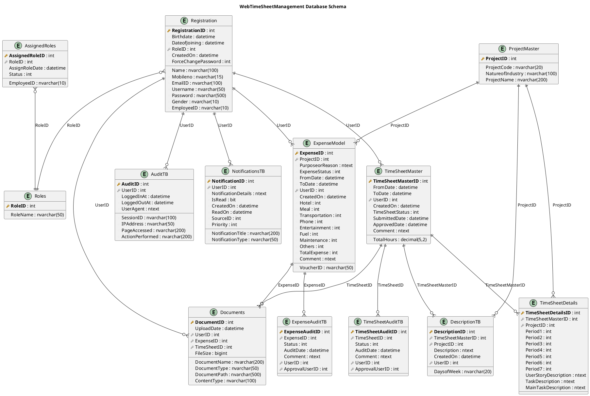

# Database Schema - Schemat Bazy Danych

## Przegląd

Baza danych aplikacji WebTimeSheetManagement wykorzystuje SQL Server z Entity Framework Code First. Schemat zawiera tabele do zarządzania użytkownikami, projektami, kartami czasu pracy, wydatkami oraz audytem.

## Entity Relationship Diagram (ERD)



## Szczegółowy Opis Tabel

### 1. Registration (Użytkownicy)
Główna tabela przechowująca informacje o użytkownikach systemu.

```sql
CREATE TABLE Registration (
    RegistrationID int IDENTITY(1,1) PRIMARY KEY,
    Name nvarchar(100) NOT NULL,
    Mobileno nvarchar(15) NOT NULL,
    EmailID nvarchar(100) NOT NULL UNIQUE,
    Username nvarchar(50) NOT NULL UNIQUE,
    Password nvarchar(500) NOT NULL,
    Gender nvarchar(10),
    Birthdate datetime,
    DateofJoining datetime,
    RoleID int,
    EmployeeID nvarchar(10),
    CreatedOn datetime DEFAULT GETDATE(),
    ForceChangePassword int DEFAULT 0,
    FOREIGN KEY (RoleID) REFERENCES Roles(RoleID)
);
```

**Indeksy**:
- `IX_Registration_Username` - Unique index na Username
- `IX_Registration_EmailID` - Unique index na EmailID
- `IX_Registration_EmployeeID` - Index na EmployeeID

### 2. Roles (Role Użytkowników)
Definicje ról użytkowników w systemie.

```sql
CREATE TABLE Roles (
    RoleID int IDENTITY(1,1) PRIMARY KEY,
    RoleName nvarchar(50) NOT NULL UNIQUE
);

-- Domyślne role
INSERT INTO Roles (RoleName) VALUES 
('Employee'),
('Manager'), 
('Admin'),
('SuperAdmin');
```

### 3. ProjectMaster (Projekty)
Informacje o projektach firmowych.

```sql
CREATE TABLE ProjectMaster (
    ProjectID int IDENTITY(1,1) PRIMARY KEY,
    ProjectCode nvarchar(20) NOT NULL UNIQUE,
    NatureofIndustry nvarchar(100),
    ProjectName nvarchar(200) NOT NULL
);
```

**Indeksy**:
- `IX_ProjectMaster_ProjectCode` - Unique index na ProjectCode
- `IX_ProjectMaster_ProjectName` - Index na ProjectName

### 4. TimeSheetMaster (Nagłówki Kart Czasu)
Główne informacje o kartach czasu pracy.

```sql
CREATE TABLE TimeSheetMaster (
    TimeSheetMasterID int IDENTITY(1,1) PRIMARY KEY,
    FromDate datetime NOT NULL,
    ToDate datetime NOT NULL,
    UserID int NOT NULL,
    CreatedOn datetime DEFAULT GETDATE(),
    TimeSheetStatus int DEFAULT 1, -- 1=Draft, 2=Submitted, 3=Approved, 4=Rejected
    TotalHours decimal(5,2),
    SubmittedDate datetime,
    ApprovedDate datetime,
    Comment ntext,
    FOREIGN KEY (UserID) REFERENCES Registration(RegistrationID)
);
```

**Indeksy**:
- `IX_TimeSheetMaster_UserID_FromDate` - Composite index dla optymalizacji zapytań
- `IX_TimeSheetMaster_TimeSheetStatus` - Index na status

**Statusy**:
- 1 = Draft (Szkic)
- 2 = Submitted (Przesłane)
- 3 = Approved (Zatwierdzone)
- 4 = Rejected (Odrzucone)

### 5. TimeSheetDetails (Szczegóły Kart Czasu)
Szczegółowe godziny pracy na projektach w danym tygodniu.

```sql
CREATE TABLE TimeSheetDetails (
    TimeSheetDetailsID int IDENTITY(1,1) PRIMARY KEY,
    TimeSheetMasterID int NOT NULL,
    ProjectID int NOT NULL,
    Period1 int, -- Monday
    Period2 int, -- Tuesday
    Period3 int, -- Wednesday
    Period4 int, -- Thursday
    Period5 int, -- Friday
    Period6 int, -- Saturday
    Period7 int, -- Sunday
    UserStoryDescription ntext,
    TaskDescription ntext,
    MainTaskDescription ntext,
    FOREIGN KEY (TimeSheetMasterID) REFERENCES TimeSheetMaster(TimeSheetMasterID) ON DELETE CASCADE,
    FOREIGN KEY (ProjectID) REFERENCES ProjectMaster(ProjectID)
);
```

**Constrainty**:
```sql
ALTER TABLE TimeSheetDetails ADD CONSTRAINT CK_Period_Range 
CHECK (Period1 BETWEEN 0 AND 24 AND Period2 BETWEEN 0 AND 24 AND 
       Period3 BETWEEN 0 AND 24 AND Period4 BETWEEN 0 AND 24 AND 
       Period5 BETWEEN 0 AND 24 AND Period6 BETWEEN 0 AND 24 AND 
       Period7 BETWEEN 0 AND 24);
```

### 6. ExpenseModel (Wydatki)
Wydatki służbowe pracowników.

```sql
CREATE TABLE ExpenseModel (
    ExpenseID int IDENTITY(1,1) PRIMARY KEY,
    ProjectID int,
    PurposeorReason ntext NOT NULL,
    ExpenseStatus int DEFAULT 1, -- 1=Submitted, 2=Approved, 3=Rejected
    FromDate datetime,
    ToDate datetime,
    UserID int NOT NULL,
    CreatedOn datetime DEFAULT GETDATE(),
    VoucherID nvarchar(50),
    Hotel int DEFAULT 0,
    Meal int DEFAULT 0,
    Transportation int DEFAULT 0,
    Phone int DEFAULT 0,
    Entertainment int DEFAULT 0,
    Fuel int DEFAULT 0,
    Maintenance int DEFAULT 0,
    Others int DEFAULT 0,
    TotalExpense AS (Hotel + Meal + Transportation + Phone + Entertainment + Fuel + Maintenance + Others),
    Comment ntext,
    FOREIGN KEY (UserID) REFERENCES Registration(RegistrationID),
    FOREIGN KEY (ProjectID) REFERENCES ProjectMaster(ProjectID)
);
```

### 7. Documents (Dokumenty)
Załączniki do kart czasu i wydatków.

```sql
CREATE TABLE Documents (
    DocumentID int IDENTITY(1,1) PRIMARY KEY,
    DocumentName nvarchar(200) NOT NULL,
    DocumentType nvarchar(50),
    DocumentPath nvarchar(500) NOT NULL,
    UploadDate datetime DEFAULT GETDATE(),
    UserID int NOT NULL,
    ExpenseID int NULL,
    TimeSheetID int NULL,
    FileSize bigint,
    ContentType nvarchar(100),
    FOREIGN KEY (UserID) REFERENCES Registration(RegistrationID),
    FOREIGN KEY (ExpenseID) REFERENCES ExpenseModel(ExpenseID),
    FOREIGN KEY (TimeSheetID) REFERENCES TimeSheetMaster(TimeSheetMasterID)
);
```

### 8. Audit Tables (Tabele Audytu)

#### TimeSheetAuditTB
```sql
CREATE TABLE TimeSheetAuditTB (
    TimeSheetAuditID int IDENTITY(1,1) PRIMARY KEY,
    TimeSheetID int NOT NULL,
    Status int NOT NULL,
    AuditDate datetime DEFAULT GETDATE(),
    Comment ntext,
    UserID int NOT NULL,
    ApprovalUserID int,
    FOREIGN KEY (TimeSheetID) REFERENCES TimeSheetMaster(TimeSheetMasterID),
    FOREIGN KEY (UserID) REFERENCES Registration(RegistrationID),
    FOREIGN KEY (ApprovalUserID) REFERENCES Registration(RegistrationID)
);
```

#### ExpenseAuditTB
```sql
CREATE TABLE ExpenseAuditTB (
    ExpenseAuditID int IDENTITY(1,1) PRIMARY KEY,
    ExpenseID int NOT NULL,
    Status int NOT NULL,
    AuditDate datetime DEFAULT GETDATE(),
    Comment ntext,
    UserID int NOT NULL,
    ApprovalUserID int,
    FOREIGN KEY (ExpenseID) REFERENCES ExpenseModel(ExpenseID),
    FOREIGN KEY (UserID) REFERENCES Registration(RegistrationID),
    FOREIGN KEY (ApprovalUserID) REFERENCES Registration(RegistrationID)
);
```

#### AuditTB (System Audit)
```sql
CREATE TABLE AuditTB (
    AuditID int IDENTITY(1,1) PRIMARY KEY,
    UserID int NOT NULL,
    SessionID nvarchar(100),
    IPAddress nvarchar(50),
    PageAccessed nvarchar(200),
    LoggedInAt datetime DEFAULT GETDATE(),
    LoggedOutAt datetime,
    UserAgent ntext,
    ActionPerformed nvarchar(200),
    FOREIGN KEY (UserID) REFERENCES Registration(RegistrationID)
);
```

### 9. NotificationsTB (Powiadomienia)
```sql
CREATE TABLE NotificationsTB (
    NotificationID int IDENTITY(1,1) PRIMARY KEY,
    UserID int NOT NULL,
    NotificationTitle nvarchar(200) NOT NULL,
    NotificationDetails ntext,
    IsRead bit DEFAULT 0,
    CreatedOn datetime DEFAULT GETDATE(),
    ReadOn datetime,
    NotificationType nvarchar(50) DEFAULT 'Info',
    SourceID int,
    Priority int DEFAULT 1, -- 1=Low, 2=Medium, 3=High
    FOREIGN KEY (UserID) REFERENCES Registration(RegistrationID)
);
```

### 10. AssignedRoles (Przypisane Role)
```sql
CREATE TABLE AssignedRoles (
    AssignedRoleID int IDENTITY(1,1) PRIMARY KEY,
    EmployeeID nvarchar(10) NOT NULL,
    RoleID int NOT NULL,
    AssignRoleDate datetime DEFAULT GETDATE(),
    Status int DEFAULT 1, -- 1=Active, 0=Inactive
    FOREIGN KEY (RoleID) REFERENCES Roles(RoleID)
);
```

### 11. DescriptionTB (Opisy Zadań)
```sql
CREATE TABLE DescriptionTB (
    DescriptionID int IDENTITY(1,1) PRIMARY KEY,
    TimeSheetMasterID int NOT NULL,
    ProjectID int NOT NULL,
    Description ntext,
    DaysofWeek nvarchar(20),
    CreatedOn datetime DEFAULT GETDATE(),
    UserID int NOT NULL,
    FOREIGN KEY (TimeSheetMasterID) REFERENCES TimeSheetMaster(TimeSheetMasterID),
    FOREIGN KEY (ProjectID) REFERENCES ProjectMaster(ProjectID),
    FOREIGN KEY (UserID) REFERENCES Registration(RegistrationID)
);
```

## Views (Widoki Bazodanowe)

### 1. TimeSheetMasterView
```sql
CREATE VIEW TimeSheetMasterView AS
SELECT 
    tsm.TimeSheetMasterID,
    tsm.FromDate,
    tsm.ToDate,
    tsm.CreatedOn,
    CASE tsm.TimeSheetStatus
        WHEN 1 THEN 'Draft'
        WHEN 2 THEN 'Submitted'
        WHEN 3 THEN 'Approved'
        WHEN 4 THEN 'Rejected'
    END AS TimeSheetStatus,
    tsm.TotalHours,
    r.Name AS EmployeeName,
    r.EmployeeID
FROM TimeSheetMaster tsm
INNER JOIN Registration r ON tsm.UserID = r.RegistrationID;
```

### 2. TimeSheetDetailsView
```sql
CREATE VIEW TimeSheetDetailsView AS
SELECT 
    tsd.TimeSheetDetailsID,
    pm.ProjectName,
    'Monday' AS DaysofWeek,
    tsd.Period1 AS Hours,
    DATEADD(day, 0, tsm.FromDate) AS Period,
    tsd.ProjectID
FROM TimeSheetDetails tsd
INNER JOIN TimeSheetMaster tsm ON tsd.TimeSheetMasterID = tsm.TimeSheetMasterID
INNER JOIN ProjectMaster pm ON tsd.ProjectID = pm.ProjectID
WHERE tsd.Period1 > 0

UNION ALL

SELECT 
    tsd.TimeSheetDetailsID,
    pm.ProjectName,
    'Tuesday' AS DaysofWeek,
    tsd.Period2 AS Hours,
    DATEADD(day, 1, tsm.FromDate) AS Period,
    tsd.ProjectID
FROM TimeSheetDetails tsd
INNER JOIN TimeSheetMaster tsm ON tsd.TimeSheetMasterID = tsm.TimeSheetMasterID
INNER JOIN ProjectMaster pm ON tsd.ProjectID = pm.ProjectID
WHERE tsd.Period2 > 0
-- ... podobnie dla pozostałych dni tygodnia
```

### 3. ExpenseModelView
```sql
CREATE VIEW ExpenseModelView AS
SELECT 
    em.ExpenseID,
    pm.ProjectName,
    em.PurposeorReason,
    CASE em.ExpenseStatus
        WHEN 1 THEN 'Submitted'
        WHEN 2 THEN 'Approved'
        WHEN 3 THEN 'Rejected'
    END AS ExpenseStatus,
    em.FromDate,
    em.ToDate,
    em.TotalExpense,
    em.VoucherID,
    r.Name AS EmployeeName,
    r.EmployeeID
FROM ExpenseModel em
INNER JOIN Registration r ON em.UserID = r.RegistrationID
LEFT JOIN ProjectMaster pm ON em.ProjectID = pm.ProjectID;
```

## Stored Procedures

### 1. GetTimeSheetsByDateRange
```sql
CREATE PROCEDURE GetTimeSheetsByDateRange
    @UserID INT,
    @FromDate DATETIME,
    @ToDate DATETIME
AS
BEGIN
    SELECT 
        tsm.*,
        r.Name AS EmployeeName,
        COUNT(tsd.TimeSheetDetailsID) AS ProjectCount,
        SUM(tsd.Period1 + tsd.Period2 + tsd.Period3 + tsd.Period4 + 
            tsd.Period5 + tsd.Period6 + tsd.Period7) AS TotalHours
    FROM TimeSheetMaster tsm
    INNER JOIN Registration r ON tsm.UserID = r.RegistrationID
    LEFT JOIN TimeSheetDetails tsd ON tsm.TimeSheetMasterID = tsd.TimeSheetMasterID
    WHERE tsm.UserID = @UserID
        AND tsm.FromDate >= @FromDate
        AND tsm.ToDate <= @ToDate
    GROUP BY tsm.TimeSheetMasterID, tsm.FromDate, tsm.ToDate, 
             tsm.CreatedOn, tsm.TimeSheetStatus, r.Name;
END
```

### 2. GetExpensesByProject
```sql
CREATE PROCEDURE GetExpensesByProject
    @ProjectID INT,
    @FromDate DATETIME,
    @ToDate DATETIME
AS
BEGIN
    SELECT 
        em.*,
        r.Name AS EmployeeName,
        pm.ProjectName
    FROM ExpenseModel em
    INNER JOIN Registration r ON em.UserID = r.RegistrationID
    INNER JOIN ProjectMaster pm ON em.ProjectID = pm.ProjectID
    WHERE em.ProjectID = @ProjectID
        AND em.FromDate >= @FromDate
        AND em.ToDate <= @ToDate
    ORDER BY em.CreatedOn DESC;
END
```

## Indexing Strategy

### Indeksy Wydajnościowe
```sql
-- TimeSheet performance indexes
CREATE INDEX IX_TimeSheetMaster_UserID_Status ON TimeSheetMaster(UserID, TimeSheetStatus);
CREATE INDEX IX_TimeSheetMaster_DateRange ON TimeSheetMaster(FromDate, ToDate);
CREATE INDEX IX_TimeSheetDetails_Master_Project ON TimeSheetDetails(TimeSheetMasterID, ProjectID);

-- Expense performance indexes  
CREATE INDEX IX_ExpenseModel_UserID_Status ON ExpenseModel(UserID, ExpenseStatus);
CREATE INDEX IX_ExpenseModel_ProjectID_Date ON ExpenseModel(ProjectID, FromDate, ToDate);

-- Audit performance indexes
CREATE INDEX IX_AuditTB_UserID_Date ON AuditTB(UserID, LoggedInAt);
CREATE INDEX IX_TimeSheetAuditTB_TimeSheetID ON TimeSheetAuditTB(TimeSheetID, AuditDate);

-- Notification performance indexes
CREATE INDEX IX_NotificationsTB_UserID_IsRead ON NotificationsTB(UserID, IsRead);
```

## Backup i Maintenance

### Backup Strategy
```sql
-- Full backup daily
BACKUP DATABASE WebTimeSheetDB 
TO DISK = 'C:\Backups\WebTimeSheetDB_Full.bak'
WITH COMPRESSION, CHECKSUM;

-- Transaction log backup every 15 minutes
BACKUP LOG WebTimeSheetDB 
TO DISK = 'C:\Backups\WebTimeSheetDB_Log.trn'
WITH COMPRESSION, CHECKSUM;
```

### Maintenance Tasks
```sql
-- Update statistics weekly
UPDATE STATISTICS TimeSheetMaster;
UPDATE STATISTICS TimeSheetDetails;
UPDATE STATISTICS ExpenseModel;

-- Rebuild indexes monthly
ALTER INDEX ALL ON TimeSheetMaster REBUILD;
ALTER INDEX ALL ON TimeSheetDetails REBUILD;
ALTER INDEX ALL ON ExpenseModel REBUILD;
```

## Data Retention Policy

### Archiwizacja Starych Danych
```sql
-- Archive timesheets older than 2 years
CREATE PROCEDURE ArchiveOldTimeSheets
AS
BEGIN
    DECLARE @ArchiveDate DATETIME = DATEADD(YEAR, -2, GETDATE());
    
    -- Move to archive table
    INSERT INTO TimeSheetMaster_Archive
    SELECT * FROM TimeSheetMaster 
    WHERE CreatedOn < @ArchiveDate;
    
    -- Delete from main table
    DELETE FROM TimeSheetMaster 
    WHERE CreatedOn < @ArchiveDate;
END
``` 