# Project Features - Funkcjonalności Aplikacji

## 📋 Spis Treści

1. [Przegląd Funkcjonalności](#przegląd-funkcjonalności)
2. [Moduł Zarządzania Czasem Pracy](#moduł-zarządzania-czasem-pracy)
3. [Moduł Zarządzania Wydatkami](#moduł-zarządzania-wydatkami)
4. [Moduł Zarządzania Użytkownikami](#moduł-zarządzania-użytkownikami)
5. [Moduł Zarządzania Projektami](#moduł-zarządzania-projektami)
6. [System Powiadomień](#system-powiadomień)
7. [System Raportowania](#system-raportowania)
8. [Moduł Bezpieczeństwa](#moduł-bezpieczeństwa)
9. [Funkcje Audytu](#funkcje-audytu)
10. [Integracje Systemowe](#integracje-systemowe)

## Przegląd Funkcjonalności

WebTimeSheetManagement to kompleksowy system zarządzania czasem pracy i wydatkami, który oferuje następujące główne obszary funkcjonalne:

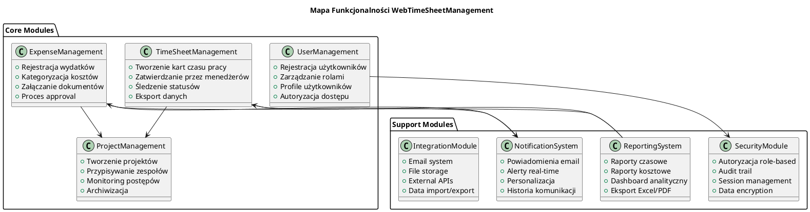

## Moduł Zarządzania Czasem Pracy

### 🕒 Tworzenie Kart Czasu Pracy

#### Funkcjonalności Podstawowe
- **Wybór okresu rozliczeniowego** (tydzień roboczy)
- **Przypisywanie godzin do projektów** (0-24h dziennie)
- **Opisy wykonanych zadań** (User Stories, Tasks, Main Tasks)
- **Walidacja danych** (automatyczna kontrola poprawności)
- **Zapisywanie jako szkic** (możliwość wielokrotnej edycji)

#### Workflow Procesu

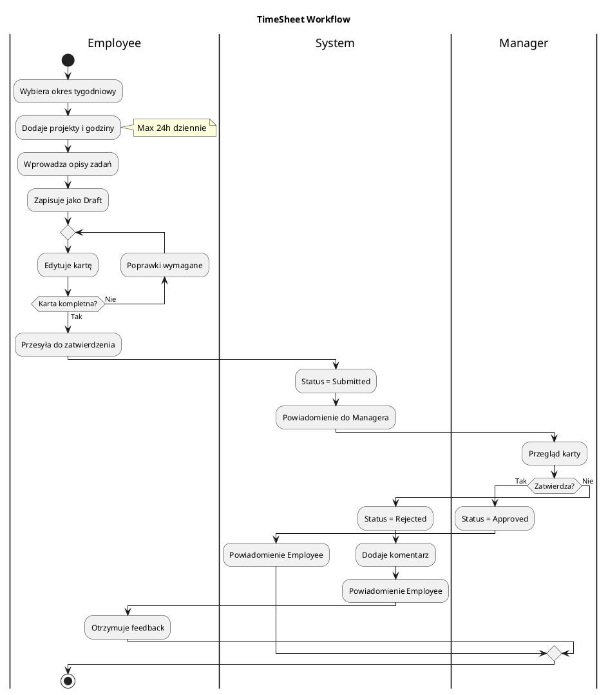

#### Szczegółowe Funkcje

**1. Wybór Projektów**
- Lista rozwijana z aktywnych projektów
- Filtrowanie po nazwie projektu
- Możliwość pracy na wielu projektach w tym samym dniu
- Walidacja czy użytkownik jest przypisany do projektu

**2. Wprowadzanie Godzin**
- Numeryczne pola dla każdego dnia tygodnia
- Walidacja zakresu (0-24 godziny)
- Automatyczne sumowanie godzin tygodniowo
- Ostrzeżenia przy przekroczeniu normy (40h/tydzień)

**3. Opisy Zadań**
- **User Story Description**: Opis historyjki użytkownika
- **Task Description**: Szczegółowy opis wykonanego zadania
- **Main Task Description**: Główne zadanie w ramach projektu

**4. Statusy Kart Czasu**
- **Draft (1)**: Szkic - możliwość edycji
- **Submitted (2)**: Przesłane - oczekuje na zatwierdzenie
- **Approved (3)**: Zatwierdzone - zaakceptowane przez menedżera
- **Rejected (4)**: Odrzucone - wymaga poprawek

### 📊 Dashboard Kart Czasu

#### Widok Pracownika
- **Aktualna karta czasu** (obecny tydzień)
- **Historia kart** (ostatnie 3 miesiące)
- **Statystyki osobiste** (średnie godziny, produktywność)
- **Powiadomienia** (statusy zatwierdzeń)

#### Widok Menedżera
- **Karty do zatwierdzenia** (lista oczekujących)
- **Statystyki zespołu** (wykorzystanie czasu)
- **Alerty** (spóźnione karty, przekroczenia norm)
- **Trendy** (wydajność w czasie)

### 🔍 Funkcje Zaawansowane

**1. Bulk Operations**
- Masowe zatwierdzanie kart
- Kopiowanie z poprzedniego tygodnia
- Bulk reject z komentarzami

**2. Templates**
- Szablony dla powtarzających się zadań
- Default project assignments
- Standardowe opisy zadań

**3. Time Tracking Analytics**
- Analiza wykorzystania czasu
- Porównanie z normami branżowymi
- Identyfikacja bottlenecków

## Moduł Zarządzania Wydatkami

### 💰 Rejestracja Wydatków

#### Typy Wydatków
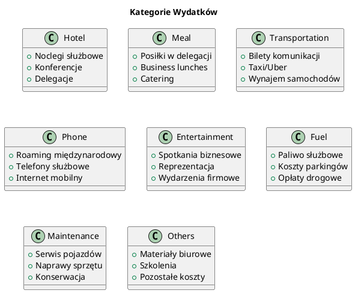

#### Proces Dodawania Wydatku

**1. Podstawowe Informacje**
- **Projekt** - wybór z listy dostępnych projektów
- **Cel/Powód wydatku** - szczegółowy opis biznesowy
- **Okres wydatku** - data od/do
- **Numer dokumentu** - ID paragonu/faktury

**2. Kategoryzacja Kosztów**
- Wprowadzenie kwot w poszczególnych kategoriach
- Automatyczne sumowanie total expense
- Walidacja maksymalnych kwot (policy compliance)

**3. Załączniki**
- Upload paragonów/faktur (PDF, JPG, PNG)
- Maksymalny rozmiar pliku: 5MB
- Automatyczne nazewnictwo plików
- Preview załączników

#### Workflow Zatwierdzania Wydatków

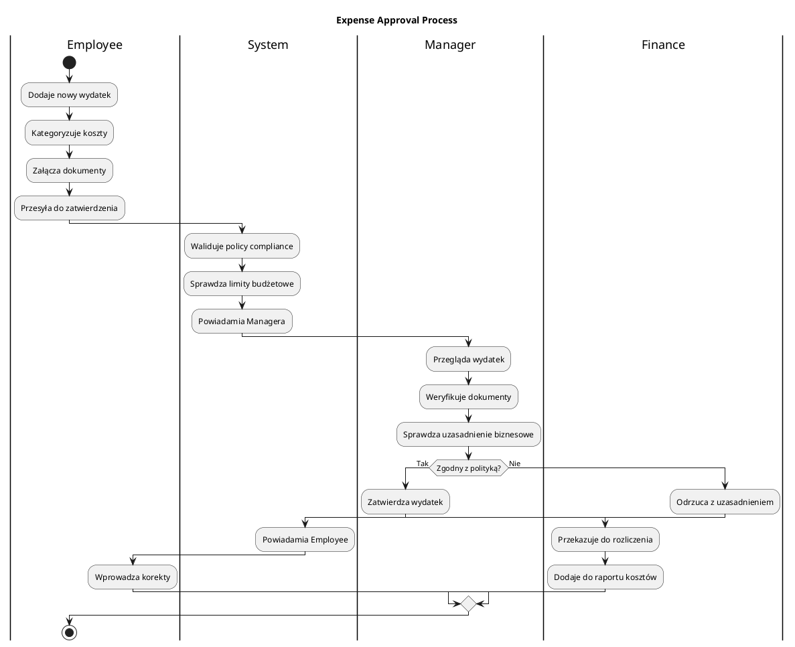

### 📋 Zarządzanie Dokumentami

#### Typy Dokumentów
- **Faktury VAT** - formalne dokumenty księgowe
- **Paragony** - dowody zakupu
- **Bilety** - dokumenty transportowe
- **Potwierdzenia** - rezerwacje, płatności online

#### Funkcje Dokumentów
- **Upload multiple files** - wiele plików na raz
- **Image preview** - podgląd zdjęć
- **File validation** - sprawdzanie formatów
- **Automatic naming** - nazwnictwo wg konwencji
- **Secure storage** - bezpieczne przechowywanie

### 💳 Expense Policies

#### Limity Wydatków
```javascript
// Przykładowe limity zgodne z polityką firmową
const ExpenseLimits = {
    Hotel: {
        daily: 300,        // 300 zł dziennie
        premium: 500       // 500 zł dla senior roles
    },
    Meal: {
        breakfast: 30,     // 30 zł śniadanie
        lunch: 50,         // 50 zł lunch
        dinner: 80         // 80 zł kolacja
    },
    Transportation: {
        domestic: 1000,    // 1000 zł krajowe
        international: 3000 // 3000 zł międzynarodowe
    },
    Entertainment: {
        monthly: 2000      // 2000 zł miesięcznie
    }
};
```

#### Reguły Compliance
- **Mandatory receipts** - wymagane paragony powyżej 50 zł
- **Business justification** - uzasadnienie biznesowe
- **Pre-approval** - wstępne zatwierdzenie dla dużych kwot
- **Currency conversion** - automatyczne przeliczenie walut

## Moduł Zarządzania Użytkownikami

### 👥 System Ról i Uprawnień

#### Hierarchia Ról

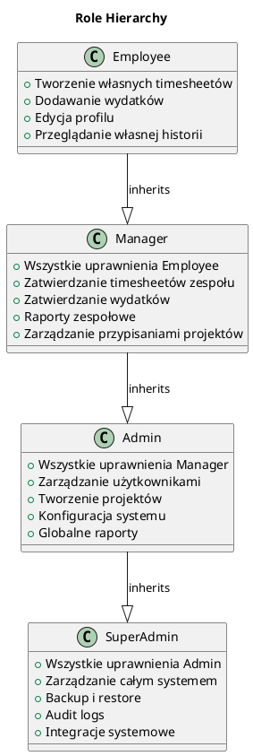

### 🔐 Proces Rejestracji

#### Rejestracja Nowego Użytkownika
**1. Podstawowe Dane**
- Imię i nazwisko (wymagane)
- Email (unikalny, walidacja formatu)
- Numer telefonu (walidacja formatu)
- Username (unikalny, min. 6 znaków)

**2. Dane Firmowe**
- Employee ID (automatyczne generowanie)
- Data zatrudnienia
- Rola początkowa (domyślnie Employee)
- Przypisanie do działu/zespołu

**3. Dane Osobowe**
- Płeć
- Data urodzenia
- Adres (opcjonalnie)

#### Workflow Aktywacji

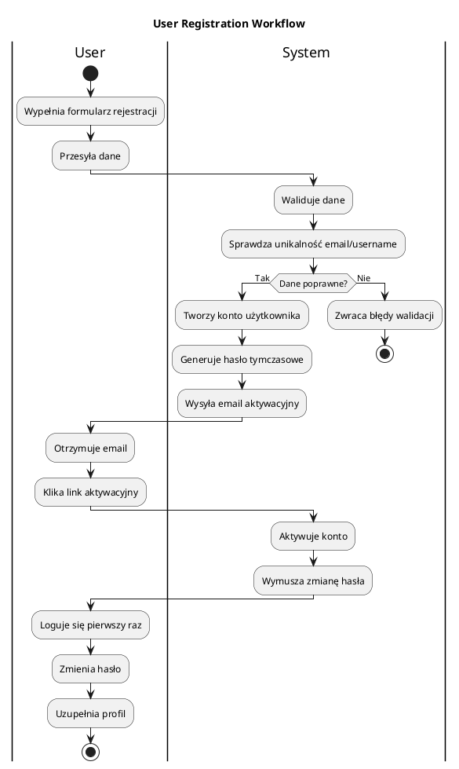

### 👤 Zarządzanie Profilami

#### Profil Użytkownika
**Dane Osobowe**
- Zdjęcie profilowe (avatar)
- Informacje kontaktowe
- Preferencje językowe
- Strefa czasowa

**Ustawienia Bezpieczeństwa**
- Zmiana hasła
- Dwuskładnikowa autoryzacja (2FA)
- Session management
- Historia logowań

**Preferencje Aplikacji**
- Dashboard layout
- Email notifications
- Default projects
- Theme preferences

### 🏢 Zarządzanie Zespołami

#### Struktura Organizacyjna
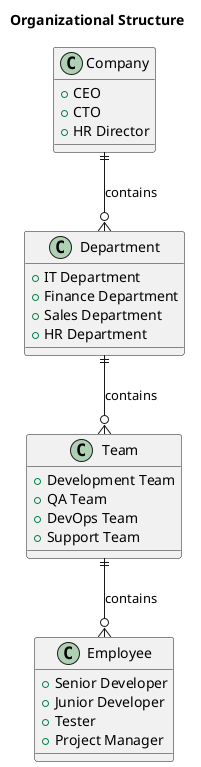

#### Funkcje Zarządzania Zespołem
- **Team assignments** - przypisywanie do zespołów
- **Project allocations** - alokacja na projekty
- **Skill matrix** - macierz umiejętności
- **Performance tracking** - śledzenie wydajności

## Moduł Zarządzania Projektami

### 🚀 Lifecycle Projektów

#### Statusy Projektów
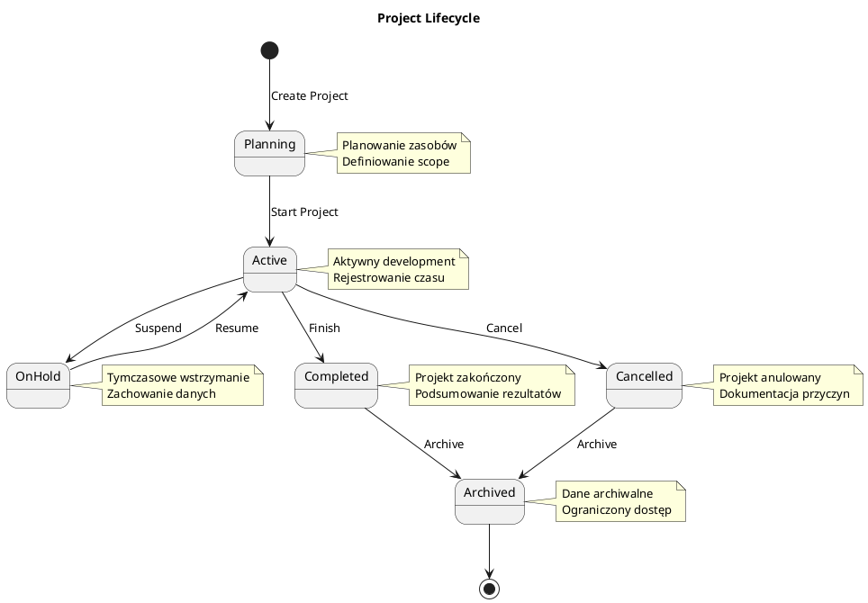

### 📊 Informacje o Projekcie

#### Podstawowe Dane
- **Project Code** - unikalny identyfikator (PROJ-YYYY-NNN)
- **Project Name** - nazwa projektu
- **Description** - szczegółowy opis
- **Nature of Industry** - branża/sektor
- **Client** - informacje o kliencie

#### Metadane Projektu
- **Start Date** - data rozpoczęcia
- **Planned End Date** - planowana data zakończenia
- **Actual End Date** - rzeczywista data zakończenia
- **Budget** - budżet projektu
- **Project Manager** - kierownik projektu
- **Team Members** - członkowie zespołu

#### Monitoring Projektów

```plantuml
@startuml
title Project Monitoring Dashboard

package "Project Metrics" {
    component TimeTracking {
        + Planned Hours vs Actual
        + Team Utilization
        + Milestone Progress
        + Overtime Analysis
    }
    
    component BudgetTracking {
        + Budget vs Actual Costs
        + Expense Categories
        + Cost per Phase
        + ROI Analysis
    }
    
    component QualityMetrics {
        + Defect Rate
        + Code Quality
        + Customer Satisfaction
        + Delivery Quality
    }
    
    component ResourceAllocation {
        + Team Allocation
        + Skill Utilization
        + Workload Distribution
        + Capacity Planning
    }
}

TimeTracking --> Dashboard
BudgetTracking --> Dashboard
QualityMetrics --> Dashboard
ResourceAllocation --> Dashboard

@enduml
```

### 🎯 Zarządzanie Zasobami

#### Przypisywanie Zespołu
- **Role-based assignment** - przypisanie na podstawie ról
- **Skill matching** - dopasowanie umiejętności
- **Capacity planning** - planowanie obciążenia
- **Time allocation** - alokacja czasu

#### Resource Optimization
- **Load balancing** - równoważenie obciążenia
- **Cross-project allocation** - praca na wielu projektach
- **Vacation planning** - planowanie urlopów
- **Training schedules** - harmonogramy szkoleń

## System Powiadomień

### 📧 Typy Powiadomień

#### Email Notifications
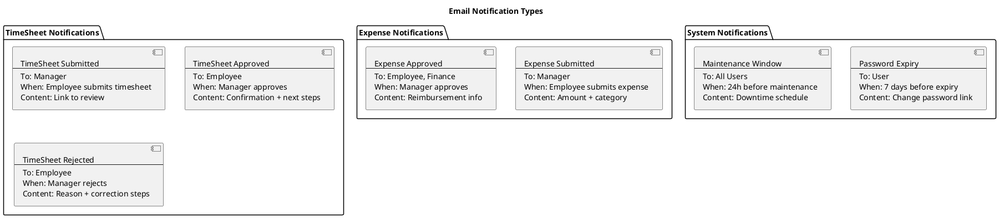

#### Real-time Notifications (SignalR)
- **Instant alerts** - natychmiastowe powiadomienia
- **Status updates** - aktualizacje statusów
- **Chat messages** - wiadomości zespołowe
- **System announcements** - ogłoszenia systemowe

### 🔔 Personalizacja Powiadomień

#### Preferencje Użytkownika
- **Email frequency** - częstotliwość emaili
- **Notification types** - typy powiadomień
- **Quiet hours** - godziny ciszy
- **Mobile push** - powiadomienia push (przyszłość)

#### Business Rules
```javascript
// Przykład reguł biznesowych dla powiadomień
const NotificationRules = {
    timesheet: {
        submission: {
            immediate: true,
            recipients: ['direct_manager'],
            template: 'timesheet_submitted'
        },
        approval: {
            immediate: true,
            recipients: ['employee', 'hr_team'],
            template: 'timesheet_approved'
        },
        overdue: {
            daily: true,
            recipients: ['employee', 'manager'],
            template: 'timesheet_overdue'
        }
    },
    expense: {
        high_amount: {
            threshold: 1000,
            immediate: true,
            recipients: ['manager', 'finance_director'],
            template: 'high_expense_alert'
        }
    }
};
```

## System Raportowania

### 📈 Typy Raportów

#### Raporty Czasowe
**1. Individual TimeSheet Report**
- Indywidualny raport czasu pracy
- Podział na projekty i zadania
- Analiza produktywności
- Porównanie z normami

**2. Team TimeSheet Summary**
- Zestawienie zespołowe
- Wykorzystanie zasobów
- Identyfikacja bottlenecków
- Planowanie capacity

**3. Project Time Analysis**
- Analiza czasu na projekt
- Porównanie plan vs actual
- Milestone tracking
- Resource utilization

#### Raporty Finansowe
**1. Expense Summary Report**
- Podsumowanie wydatków
- Kategoryzacja kosztów
- Compliance analysis
- Trend analysis

**2. Project Cost Report**
- Koszty projektowe
- Budget vs actual
- Cost per milestone
- ROI analysis

**3. Department Budget Report**
- Budżet departamentu
- Variance analysis
- Cost center reporting
- Forecast accuracy

### 📊 Dashboard Analytics

#### Executive Dashboard
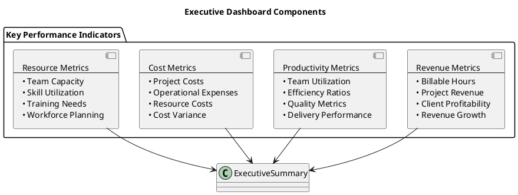

#### Manager Dashboard
- **Team performance** - wydajność zespołu
- **Project status** - status projektów
- **Resource allocation** - alokacja zasobów
- **Pending approvals** - oczekujące zatwierdzenia

#### Employee Dashboard
- **Personal statistics** - statystyki osobiste
- **Recent activities** - ostatnie aktywności
- **Upcoming deadlines** - nadchodzące terminy
- **Notification center** - centrum powiadomień

### 📋 Export Capabilities

#### Formaty Eksportu
- **Excel (XLSX)** - szczegółowe dane, formatowanie
- **PDF** - raporty formalne, prezentacje
- **CSV** - import do innych systemów
- **JSON/XML** - integracje API

#### Scheduled Reports
- **Daily reports** - codzienne podsumowania
- **Weekly summaries** - tygodniowe zestawienia
- **Monthly analytics** - miesięczne analizy
- **Quarterly reviews** - kwartalne przeglądy

## Moduł Bezpieczeństwa

### 🔐 Autoryzacja i Autoryzacja

#### Authentication Methods
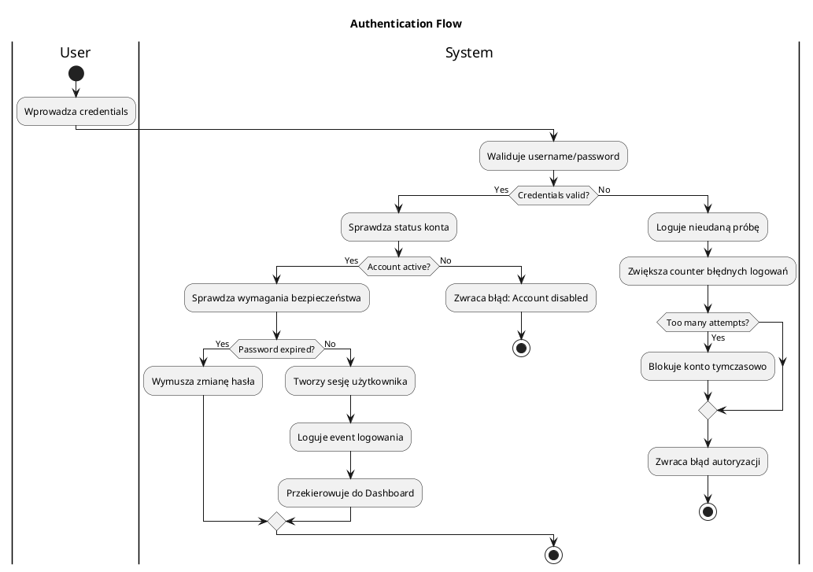

#### Role-Based Access Control (RBAC)
- **Granular permissions** - szczegółowe uprawnienia
- **Resource-based access** - dostęp na podstawie zasobów
- **Context-aware security** - bezpieczeństwo kontekstowe
- **Principle of least privilege** - minimalne uprawnienia

### 🛡️ Security Features

#### Data Protection
- **Encryption at rest** - szyfrowanie danych w spoczynku
- **Encryption in transit** - szyfrowanie transmisji (HTTPS)
- **Database encryption** - szyfrowanie bazy danych
- **Sensitive data masking** - maskowanie wrażliwych danych

#### Session Management
- **Session timeout** - automatyczne wylogowanie
- **Concurrent session control** - kontrola równoczesnych sesji
- **Session invalidation** - unieważnianie sesji
- **Remember me** - funkcja zapamiętywania

#### Security Monitoring
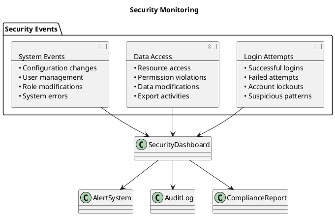

## Funkcje Audytu

### 📝 Audit Trail

#### Typy Eventów Audytowych
**1. User Activities**
- Login/logout events
- Password changes
- Profile modifications
- Permission grants/revokes

**2. Data Changes**
- TimeSheet modifications
- Expense submissions
- Project updates
- User management changes

**3. System Events**
- Configuration changes
- System maintenance
- Error events
- Performance issues

#### Audit Log Structure
```json
{
  "auditId": "AUD-2025-001234",
  "timestamp": "2025-01-15T10:30:00Z",
  "userId": "EMP001",
  "sessionId": "SES-ABC123",
  "ipAddress": "192.168.1.100",
  "userAgent": "Mozilla/5.0...",
  "eventType": "DATA_MODIFICATION",
  "resource": "TimeSheet",
  "resourceId": "TS-2025-0001",
  "action": "UPDATE",
  "oldValues": {
    "status": "Draft",
    "totalHours": 40
  },
  "newValues": {
    "status": "Submitted",
    "totalHours": 42
  },
  "result": "SUCCESS",
  "description": "TimeSheet submitted for approval"
}
```

### 🔍 Compliance Reporting

#### Regulatory Compliance
- **GDPR compliance** - zgodność z RODO
- **Data retention policies** - polityki retencji danych
- **Right to be forgotten** - prawo do bycia zapomnianym
- **Data portability** - przenośność danych

#### Financial Compliance
- **Expense policy compliance** - zgodność z polityką wydatków
- **Tax reporting** - raportowanie podatkowe
- **Audit trail for expenses** - ślad audytowy wydatków
- **Financial controls** - kontrole finansowe

## Integracje Systemowe

### 🔌 External Integrations

#### Email System Integration
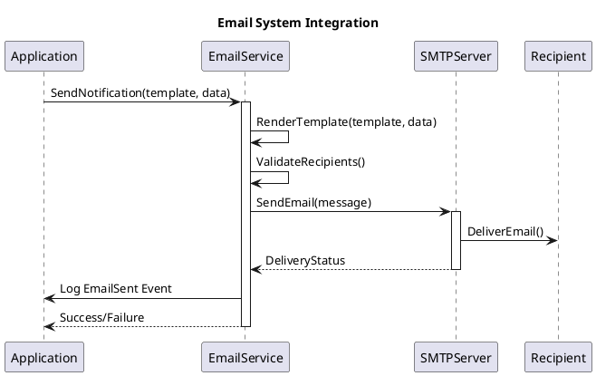

#### File Storage Integration
- **Local file system** - lokalne przechowywanie
- **Cloud storage** - przechowywanie w chmurze (Azure Blob, AWS S3)
- **CDN integration** - integracja z CDN
- **Backup to cloud** - backup do chmury

#### API Integrations
**1. HR System Integration**
- Employee data synchronization
- Organizational structure sync
- Role management integration

**2. Accounting System Integration**
- Expense data export
- Financial reporting integration
- Budget data synchronization

**3. Project Management Tools**
- Project data synchronization
- Task management integration
- Timeline synchronization

### 📊 Data Import/Export

#### Import Capabilities
- **User import** - import użytkowników (CSV, Excel)
- **Project import** - import projektów
- **Bulk operations** - operacje masowe
- **Data validation** - walidacja importowanych danych

#### Export Capabilities
- **TimeSheet data** - dane kart czasu
- **Expense data** - dane wydatków
- **User data** - dane użytkowników (GDPR compliant)
- **Audit logs** - logi audytowe

#### API Endpoints
```http
# TimeSheet API
GET /api/timesheets?from=2025-01-01&to=2025-01-31
POST /api/timesheets
PUT /api/timesheets/{id}
DELETE /api/timesheets/{id}

# Expense API
GET /api/expenses?userId=123&status=approved
POST /api/expenses
PUT /api/expenses/{id}/approve
PUT /api/expenses/{id}/reject

# User API
GET /api/users
POST /api/users
PUT /api/users/{id}
GET /api/users/{id}/timesheets

# Project API
GET /api/projects
POST /api/projects
PUT /api/projects/{id}
GET /api/projects/{id}/members
```

## Roadmap Funkcjonalności

### Short Term (Q1-Q2 2025)
- [ ] **Mobile App** - aplikacja mobilna
- [ ] **Advanced Reporting** - zaawansowane raporty
- [ ] **API v2** - nowa wersja API
- [ ] **Single Sign-On (SSO)** - integracja z Active Directory

### Medium Term (Q3-Q4 2025)
- [ ] **AI-powered Analytics** - analityka oparta na AI
- [ ] **Workflow Automation** - automatyzacja procesów
- [ ] **Advanced Project Management** - zaawansowane zarządzanie projektami
- [ ] **Multi-language Support** - wsparcie wielu języków

### Long Term (2026+)
- [ ] **Machine Learning** - uczenie maszynowe
- [ ] **Predictive Analytics** - analityka predykcyjna
- [ ] **Voice Interface** - interfejs głosowy
- [ ] **Blockchain Integration** - integracja z blockchain

---

**© 2025 WebTimeSheetManagement - Complete Feature Documentation** 